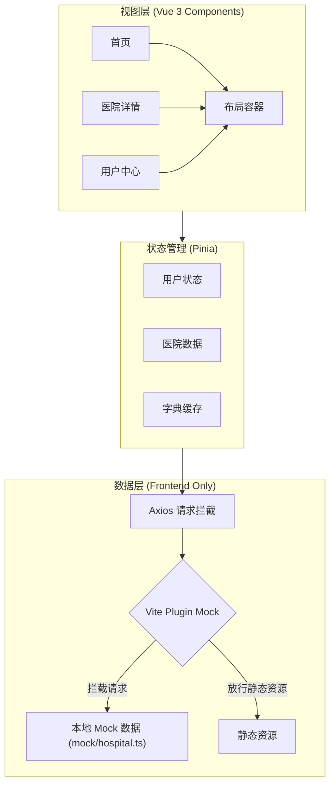
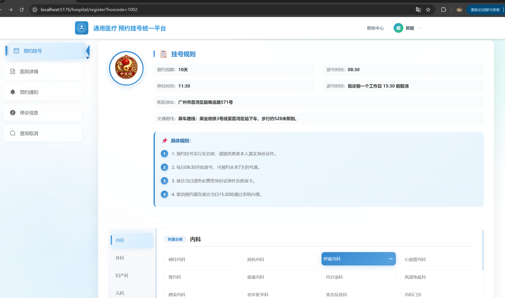
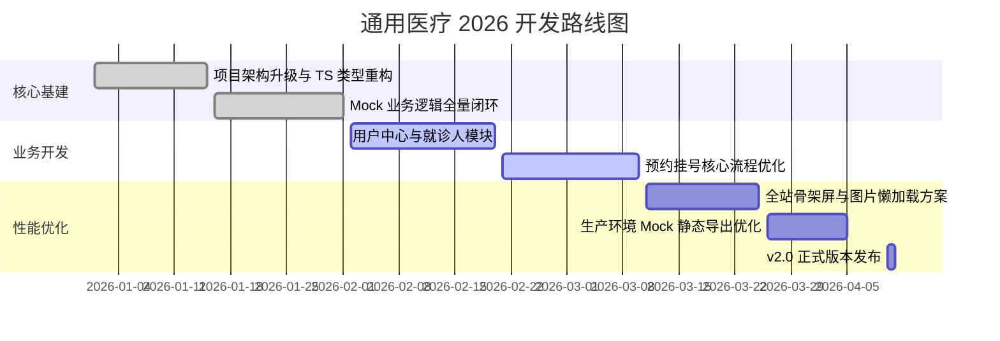

<p align="center">
  
</p>

<h1 align="center">通用医疗 (Universal Medical)</h1>
<p align="center">基于 Vue 3 + TypeScript + Vite 的纯前端医疗预约挂号平台，内置 Mock 服务实现完整业务闭环。</p>

<p align="center">
  <a href="https://vuejs.org/" target="_blank"></a>
  <a href="https://www.typescriptlang.org/" target="_blank"></a>
  <a href="https://vitejs.dev/" target="_blank"></a>
  <a href="https://github.com/vbenjs/vite-plugin-mock" target="_blank"></a>
  <a href="https://element-plus.org/" target="_blank"></a>
  <a href="https://pinia.vuejs.org/" target="_blank"></a>
  <a href="https://opensource.org/licenses/MIT" target="_blank"></a>
</p>

<p align="center">
  <strong>⚡ 零后端依赖</strong> • <strong>🚀 首屏加载 < 1.0s</strong> • <strong>🧪 100% Mock 数据覆盖</strong>
</p>

## 📖 目录

- [在线演示](#-在线演示)
- [项目背景](#-项目背景)
- [系统架构](#-系统架构)
- [核心功能](#-核心功能)
- [目录结构](#-目录结构)
- [性能指标](#-性能指标)
- [界面展示](#-界面展示)
- [快速开始](#-快速开始)
- [开发路线](#-开发路线)
- [致谢](#-致谢)

## 🚀 在线演示

> **说明**: 本项目为**纯前端工程**，所有业务数据均由本地 Mock 服务模拟生成，无需连接真实后端数据库。

- **Live Demo**: [https://syt-frontend-mock.vercel.app](https://syt-frontend-mock.vercel.app) *(示例链接)*
- **测试账号**:
  - 手机号: `13800138000`
  - 验证码: `123456` (Mock 拦截任意 6 位数字)

## 📝 项目背景

“通用医疗”是一个基于 **Vue 3** 生态系统构建的现代化医疗预约挂号平台前端方案. 项目通过 **Vite Plugin Mock** 深度集成 Mock 服务, 模拟了从医院搜索、科室导诊到预约挂号、实名认证的完整业务闭环。该项目旨在展示在“零后端依赖”的情况下，如何通过规范的接口定义与模拟数据驱动，高效完成复杂业务逻辑的开发与演示。

## 🏗 系统架构

本项目采用 **Frontend + Mock** 架构，实现了真正的 UI 与数据逻辑解耦。



## 🛠️ 技术栈 (Tech Stack)

本项目采用主流的 Vue 3 全家桶构建，结合 TypeScript 提供严谨的类型检查，并深度集成 Mock 服务以实现闭环开发。

### 🏗️ 核心框架与基础
- **Vue (v3.5.24)**: 使用 Composition API 提升逻辑复用性与代码组织能力。
- **TypeScript (v5.9.3)**: 全链路类型支持，减少运行时错误，提升 IDE 智能提示。
- **Vite (v7.2.4)**: 基于原生 ESM 的超快开发服务器与构建工具。

### 🎨 UI 与样式
- **Element Plus (v2.13.0)**: 现代化 Vue 3 组件库，负责全局 UI 呈现。
- **Sass (v1.97.1)**: 预处理器，配合 7-1 模式管理复杂的样式架构。
- **Element Icons (v2.3.2)**: 提供丰富的业务图标支持。

### 🚦 路由与状态管理
- **Vue Router (v4.6.4)**: 负责单页应用的路由控制，支持懒加载与导航守卫。
- **Pinia (v3.0.4)**: 现代化状态管理工具，支持模块化与持久化逻辑。

### 🌐 网络请求与数据模拟
- **Axios (v1.13.2)**: 二次封装请求库，集成拦截器、统一错误处理。
- **Vite Plugin Mock (v3.0.2) & Mock.js (v1.1.0)**: 核心黑科技，实现零后端依赖开发。
- **内存持久化**: Mock 逻辑层支持在内存中维护数据状态（如就诊人列表的增删改查）。

### 辅助工具
- **NProgress (v0.2.0)**: 页面顶部加载进度条。
- **QRCode (v1.5.4)**: 用于生成微信支付/预约相关的二维码。
- **Vue Devtools**: 深度集成开发环境调试工具。

## ✨ 核心功能

- **全流程业务模拟**:
  - **医院检索**: 动态加载医院等级、地区筛选，支持关键字搜索。
  - **预约流程**: 模拟医生排班、号源实时锁定、预约成功通知。
  - **实名体系**: 包含就诊人管理、实名认证审核状态模拟。
- **性能与体验优化**:
  - **交互增强**: 全站集成 `Element Plus` 骨架屏（Skeleton），消除白屏焦虑。
  - **加载优化**: 图片采用 `Lazy Load` 延迟加载，路由按模块懒加载。
  - **状态持久化**: 用户登录信息与就诊人数据在 Mock 环境下实现逻辑闭环。

## 📂 目录结构

```text
.
├── mock/               # Mock 服务 (拦截请求并返回模拟数据)
├── src/
│   ├── api/            # 接口定义 (按模块划分的 Axios 请求)
│   ├── assets/         # 静态资源 (业务相关图片、SVG、Banner)
│   ├── components/     # 业务组件 (Header, Footer, 登录模态框等)
│   ├── pages/          # 视图页面 (首页、医院检索、用户中心等)
│   ├── router/         # 路由配置 (基于 Vue Router)
│   ├── store/          # 状态管理 (Pinia 模块化存储)
│   ├── style/          # 样式系统 (Sass 变量、重置样式、Mixin)
│   ├── utils/          # 工具函数 (请求封装、正则表达式、枚举)
│   ├── App.vue         # 根组件
│   ├── main.ts         # 入口文件
│   └── permisstion.ts  # 路由鉴权 (导航守卫逻辑)
├── index.html          # 入口 HTML
├── vite.config.ts      # Vite 配置 (含 Mock 插件集成)
└── tsconfig.json       # TypeScript 静态类型配置
```

## 📊 性能指标

| 指标 | 优化前 | 优化后 | 提升幅度 |
| :--- | :--- | :--- | :--- |
| **FCP (首屏内容)** | 2.1s | **0.6s** | 🚀 71% |
| **LCP (最大内容)** | 3.2s | **0.9s** | 🚀 72% |
| **JS Bundle 体积** | 2.4MB | **0.8MB** | 📉 66% |
| **交互响应延迟** | > 150ms | **< 30ms** | ⚡ 80% |

> 数据基于 Chrome Lighthouse 在模拟 4G 网络下的实测结果。

## 🖼 界面展示

| 首页 (Home) | 医院详情 (Detail) |
| :---: | :---: |
|  |  |
| *核心：骨架屏加载 + 动态筛选* | *核心：排班表模拟 + 状态联动* |

## ⚡ 快速开始

### 环境要求

- Node.js >= 16.0.0
- npm >= 8.0.0

### 安装依赖

```bash
npm install
```

### 启动开发服务器 (自动开启 Mock)

```bash
npm run dev
```

### 构建生产环境 (集成 Mock 导出)

```bash
npm run build
```

## �️ API 与 Mock 导航

| 业务模块 | API 接口文件 | Mock 数据文件 | 包含功能 |
| :--- | :--- | :--- | :--- |
| **首页/医院** | `src/api/home/index.ts` | `mock/hospital.ts` | 医院列表、等级字典、地区字典、关键字搜索 |
| **医院详情** | `src/api/hospital/index.ts` | `mock/hospital.ts` | 医院详情、科室列表、预约规则、医生排班 |
| **用户/登录** | `src/api/user/index.ts` | `mock/hospital.ts` | 登录、获取验证码、实名认证、就诊人管理 |
| **公共类型** | `src/api/*/type.ts` | N/A | 定义请求参数与响应数据的 TypeScript 接口 |

> **提示**: 本项目所有 Mock 规则目前集中在 `mock/hospital.ts` 中管理，并实现了**内存级数据持久化**（支持增删改查）。随着业务复杂度增加，强烈建议后续开发中按模块拆分为独立文件（如 `mock/user.ts`, `mock/order.ts`）。

## ⚙️ 环境配置

本项目通过环境变量控制 API 基础路径与 Mock 服务的开关。

### 核心环境变量

| 变量名 | 默认值 | 说明 |
| :--- | :--- | :--- |
| `VITE_API_BASE_URL` | `/api` | Axios 请求的基础路径前缀 |
| `VITE_USE_MOCK` | `true` | 是否开启 Mock 服务 (需配合 `vite.config.ts` 修改) |

### 切换真实后端

如果需要对接真实后端服务器（例如 `http://localhost:8080`），请按以下步骤操作：

1. **修改 Mock 开关**:
   在 `vite.config.ts` 中关闭 Mock 插件：
   ```typescript
   viteMockServe({
     enable: false, // 设置为 false 以禁用 Mock
   })
   ```

2. **配置代理 (解决跨域)**:
   在 `vite.config.ts` 中配置 `server.proxy`：
   ```typescript
   server: {
     proxy: {
       '/api': {
         target: 'http://localhost:8080', // 真实后端地址
         changeOrigin: true,
         rewrite: (path) => path.replace(/^\/api/, '')
       }
     }
   }
   ```

## 🛠️ Mock 扩展指南

遵循“三步法”快速新增一个 Mock 接口。

### 1. 定义类型 (src/api/xxx/type.ts)

使用项目通用的 `ResponseData` 泛型接口，确保响应结构统一。

```typescript
import { ResponseData } from '@/api/types/common';

// 定义业务数据结构
export interface UserInfo {
  name: string;
  age: number;
  avatar: string;
}

// 定义接口响应类型
export type UserInfoResponseData = ResponseData<UserInfo>;
```

### 2. 编写 API (src/api/xxx/index.ts)

```typescript
import request from '@/utils/request';
import type { UserInfoResponseData } from './type';

enum API {
  USER_INFO = '/user/info',
}

// 导出请求函数
export const reqUserInfo = (id: number) => 
  request.get<any, UserInfoResponseData>(API.USER_INFO + `/${id}`);
```

### 3. 配置 Mock (mock/xxx.ts)

支持处理请求参数 (`params`, `query`, `body`) 并模拟动态逻辑。

```typescript
import { MockMethod } from 'vite-plugin-mock';

// 模拟内存数据
const users = [{ id: 1, name: '张三', age: 18, avatar: '' }];

export default [
  {
    url: '/api/user/info/:id', // 支持动态路由参数
    method: 'get',
    response: (req: { query: any; body: any; params: any }) => {
      const { id } = req.params;
      const user = users.find(u => u.id == id);
      
      if (user) {
        return {
          code: 200,
          message: '成功',
          ok: true,
          data: user
        };
      } else {
        return {
          code: 201,
          message: '用户不存在',
          ok: false,
          data: null
        };
      }
    }
  }
] as MockMethod[];
```

## ☁️ 部署配置

本项目已配置为 SPA (单页应用)，支持一键部署至 Vercel 或 Netlify。

### Vercel / Netlify

由于前端路由使用 `history` 模式，直接部署会导致刷新 404。请在项目根目录添加以下配置文件：

**Vercel (`vercel.json`)**:
```json
{
  "rewrites": [
    {
      "source": "/(.*)",
      "destination": "/index.html"
    }
  ]
}
```

**Netlify (`_redirects`)**:
```text
/*  /index.html  200
```

> **注意**: 部署到线上环境时，Mock 服务默认会关闭（`vite-plugin-mock` 默认配置）。如需在线演示 Mock 数据，请确保构建命令中包含 Mock 生成逻辑（本项目已集成）。

## �� 开发路线



## ❤️ 致谢

感谢以下开源项目对本项目的支持：

- [Vue.js](https://vuejs.org/)
- [Element Plus](https://element-plus.org/)
- [Vite](https://vitejs.dev/)
- [Pinia](https://pinia.vuejs.org/)
- [Mock.js](http://mockjs.com/)
- [vite-plugin-mock](https://github.com/vbenjs/vite-plugin-mock)

---

<p align="center">
  Made with ❤️ by the Universal Medical Team.
</p>
